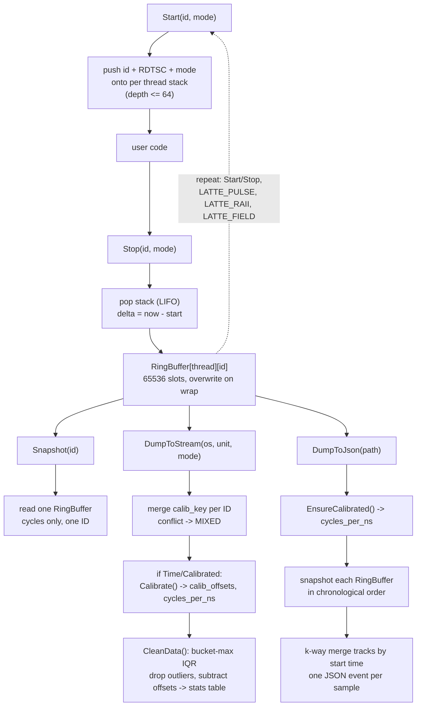

# ☕️ Latte


Single header C++17 telemetry library.
Goal: least possible overhead, an API you can use in one line, and built in statistics.

- Measures CPU cycles with x86_64 RDTSC / RDTSCP timestamp counters.
- Zero allocations after the first call per ID per thread.
- Latency only, no aggregation, no tracing transport, no hardware counters.
- Header only, no build step, no linking.
- Compile with `LATTE_DISABLE` defined to strip every call to a no-op. Ship the same call sites in debug and release.

---

## Public API

### Modes and monitoring calls

3 modes, pick by tradeoff between overhead and ordering:

| Mode | Intrinsic | Ordering | Use for |
|---|---|---|---|
| `Fast` | `__rdtsc` | none | hot path, coarse polling |
| `Mid` | `__rdtscp` | partial barrier | default function profiling |
| `Hard` | `lfence` + `__rdtscp` | full serialize | tiny snippets, few dozen cycles |

#### `Latte::Fast::Start(id)` / `Latte::Fast::Stop(id)`

Manual pair, any block (same API for `Mid`, `Hard`):

```cpp
Latte::Fast::Start("ProcessOrder");
// work
Latte::Fast::Stop("ProcessOrder");
```

- `id` is a string literal, no registration needed.
- Nesting works up to 64 active slots per thread, any mix of modes:

```cpp
Latte::Fast::Start("Frame_Total");
Latte::Mid::Start("Physics_Engine");
Latte::Mid::Stop("Physics_Engine");
Latte::Fast::Stop("Frame_Total");
```

#### `LATTE_RAII(mode)`

Scope guard. Start on construction, Stop on scope exit, return, or exception:

```cpp
void ProcessOrder() {
    LATTE_RAII(); // Fast mode, id = __func__
    if (SomeCondition()) return; // Stop() fires automatically when leaving
    // work
}
```

- Defaults to Fast. `LATTE_RAII(Mid)` and `LATTE_RAII(Hard)` pick a mode.
- Inside a lambda, `__func__` is `"operator()"`, not the enclosing function name.
- Nesting follows normal C++ destruction order (LIFO), same as manual Start/Stop.
- Prefer this over manual Start/Stop: an early return or exception between a manual pair leaves the stack unbalanced.

#### `LATTE_FIELD(expr)`

Runs `expr`, times it in Fast mode, returns its result unchanged:

```cpp
int out = LATTE_FIELD(Compute(x, y)); // recorded under "Compute"
```

- `expr` can be any call, with any inputs, arguments flow through normally.
- Result keeps its value category: an lvalue result comes back as a reference, not a copy.
- Always Fast mode, no mode argument.
- The recorded id is the name of the wrapped call, not the caller's function: the expression is kept up to the first `(` (or used whole when there is none), capped at 128 chars. `LATTE_FIELD(std::min(a, b))` records as `std::min`.

#### `LATTE_PULSE(id)`

Cycle delta between successive calls, same thread. Used inside loops:

```cpp
for (;;) {
    // poll or process
    LATTE_PULSE("Toroidal_Record");
}
```

- First call sets the reference point, pushes no sample.

### Runtime extraction

#### `Latte::Snapshot(id)`

Pull raw cycle samples for one ID, across all threads, at any point at runtime. Returns a read-only result that behaves like the underlying vector:

```cpp
auto samples = Latte::Snapshot("Physics_Engine");
size_t n = samples.size();
for (Latte::Cycles c : samples) { /* ... */ }
```

#### `Latte::Snapshot(id).to_ns()`

Translates raw snapshot values to nanoseconds using the calibrated CPU frequency:

```cpp
std::vector<double> ns = Latte::Snapshot("Physics_Engine").to_ns();
```

Same result through the free function `Latte::ToNs`:

```cpp
std::vector<Latte::Cycles> raw = Latte::Snapshot("Physics_Engine");
std::vector<double> ns = Latte::ToNs(raw);
```

- Same deferred one-time calibration as the dumps: the first call costs about 120 ms, then cached.
- One `double` per input sample, empty in means empty out.
- Raw values only: the per-mode Start/Stop self-offset is not subtracted. Use `DumpToStream` with `Parameter::Calibrated` when you need that.

#### `LATTE_FREQ(cycles_per_ns)`

Estimates the CPU's cycles per nanosecond, writes it into the variable you pass:

```cpp
double cpns;
LATTE_FREQ(cpns); // ~120 ms measurement against CLOCK_MONOTONIC_RAW
```

- `DumpToStream`, `DumpToJson`, and `ToNs` call this internally the first time they need calibrated time.
- You only call it yourself if you need `cycles_per_ns` outside those.

#### `Latte::FormatTime(ns)`

Translation helper, turns a raw nanosecond value into a human string with the right unit:

```cpp
std::string s = Latte::FormatTime(1882.44); // "1.88 us"
```

- Picks ns, us, ms, s, or min based on magnitude.
- Used internally by `DumpToStream` in `Parameter::Time` mode.

### Dumping data

#### `Latte::DumpToStream`

Human readable report, call once after all worker threads finish instrumenting:

```cpp
Latte::DumpToStream(std::cout, Latte::Parameter::Time, Latte::Parameter::Calibrated);
```

- Defaults: `Parameter::Cycle`, `Parameter::Raw`.
- Calibrated mode subtracts measured Start/Stop overhead per mode pair before computing stats, and prints that overhead as a second table.

#### `Latte::DumpToJson`

Flat Chrome Trace JSON array, every sample, all threads:

```cpp
Latte::DumpToJson("dump.json");
```

- Drop the file into Perfetto (ui.perfetto.dev) or chrome://tracing.
- Each bar spans `ts` to `ts + dur`. Nesting is computed from bar overlap, one lane per real OS thread id.
- A `LATTE_PULSE` bar is one loop iteration. Consecutive pulses form one fused bar spanning the whole loop.
- Raw values only, no overhead subtraction, no outlier filtering.
- Zoom in first (`W`/`S` in Perfetto): a fresh run spans hours to nanoseconds and looks blank until you do.

---

## Project insight

### Technology used

- C++17, header only, no dependencies outside the standard library.
- x86_64 intrinsics: `__rdtsc`, `__rdtscp`, `_mm_lfence` (`<x86intrin.h>` on GCC/Clang, `<intrin.h>` on MSVC).
- `thread_local` storage, no cross thread locking on the hot path.
- Chrome Trace Event Format for the JSON export, so any Perfetto or `chrome://tracing` build can load it with no custom tooling.

### Design choices

- **Zero contention**: each thread owns its own `ThreadStorage` and ring buffers. No mutex, no atomic, on `Start`/`Stop`/`LATTE_PULSE`/`LATTE_RAII`/`LATTE_FIELD`. The global mutex only guards the list of thread pointers, not the data inside them.
- **ID as pointer**: IDs are `const char*`, compared and stored by address. No string hashing, no `strcmp`. Only string literals or stable static storage are safe to pass.
- **Fixed size ring buffer**: 65536 samples per `(thread, ID)` by default (`BUFFER_PWR = 16`, must stay a power of 2 for the bitmask wrap). Bounded memory, no runtime growth, oldest sample silently overwritten past capacity.
- **Cache friendly layout**: `alignas(64)` ring buffers and Structure of Arrays for the per thread stack, so only the timing fields a hot path needs land in the same cache line.
- **Deferred calibration**: overhead measurement runs once, lazily, on first `DumpToStream`/`DumpToJson` call that needs it, not on every `Start`/`Stop`. Steady state sampling pays nothing for it.
- **Bucket max IQR cleaning**: outlier detection runs on the max of 1000 sample buckets, not on raw samples. More robust against long tail latency spikes than a raw IQR pass.
- **Compile time kill switch**: `LATTE_DISABLE` swaps every function and macro for a no-op with the same signature, so instrumented code compiles unchanged in a build with no observer effect at all.

### Data flow

From the first recorded sample to a printed report or a JSON file:



---

## Benchmarks

Pinned core, AMD Ryzen 5 7600X @ 4.7GHz, `-O3 -march=native`.
100k iterations x 100 trials, 1 warmup batch. 1 cycle is about 0.213ns.

Median cycles per region, single call unless noted (Start+Stop pairs double the raw timer rows):

| Kind | Region | Cycles | ns |
|---|---|---:|---:|
| Raw timer | `__rdtsc` | 29.9 | 6.4 |
| Raw timer | `__rdtscp` | 57.5 | 12.2 |
| Raw timer | `_LFENCE` | 14.7 | 3.1 |
| Latte | `Fast::Start+Stop` | 60.0 | 12.8 |
| Latte | `Mid::Start+Stop` | 119.7 | 25.5 |
| Latte | `Hard::Start+Stop` | 175.4 | 37.4 |
| Latte | `LATTE_PULSE` | 29.8 | 6.3 |
| Caliper | Caliper runtime report | 1212.8 | 258.0 |
| Caliper | Caliper event trace | 1501.8 | 319.5 |
| Likwid | Likwid active | 28951 | 6160 |
| Tracy | Tracy connected | 75.4 | 16.0 |
| Tracy | Tracy always on | 151.3 | 32.2 |
| std::chrono | `std::chrono::now` x2 | 193.0 | 41.1 |

Latte measures latency only. Caliper adds aggregation and tracing. Likwid adds hardware counter reads. Tracy adds profiler transport.

Measurement error vs a 4µs workload:

| Tool | Bias |
|---|---:|
| Latte Fast | -15ns (-0.3%) |
| Caliper runtime report | +257ns (+6.9%) |
| Likwid RDTSC Runtime | +545ns (+13.3%) |

---

## Contributions

- Build and run the full test matrix: `just all` then `just run` (needs a `just` install, GCC or Clang, x86_64).
- `just check` compiles `Latte.hpp` with `-fsyntax-only`, both with and without `LATTE_DISABLE`. Run it before opening a PR.
- `just run-sanity` runs the correctness suite (`test/sanity.cpp`) enabled and disabled.
- `just run-bench-caliper` / `just run-bench-annot` reproduce the overhead comparison tables above (need Caliper, Likwid, Tracy, Google Benchmark installed under `~/.local`).
- Open a PR against `main`. Keep changes to `Latte.hpp` header only, no new runtime dependencies.

## Licensing

Public Domain.
